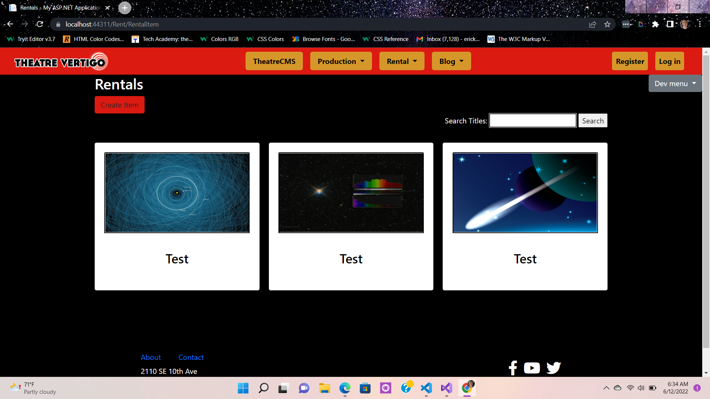

# LiveProject-CodeSummary
Code Summary of C#/.NET Live Project!

## Introduction
I was part of a Live project for the last two weeks, where we used C# with the .NET Framework to build a full MVC Web App for a production company. The cool thing about this project was we utilized Agile methodologies and daily Scrums. I learned the logistics behind coding with other developers, utilizing version control by branching and making pull requests with master.

## CRUD Functionality
This was a code first approach to using the entity frame work, I scaffolded my CRUD based off my Model. I added an input element to the Create view for the user to upload a photo of their item, which also had an area with an image preview as well using JS.

### Model
        public class RentalItem
    {
        public int RentalItemId { get; set; }

        public string Item { get; set; }

        public string ItemDescription { get; set; }

        public DateTime PickUpDate { get; set; }

        public DateTime? ReturnDate { get; set; }

        public Byte[] ItemPhoto { get; set; }
    }
    
### Controller
      using System;
      using System.Collections.Generic;
      using System.Data;
      using System.Data.Entity;
      using System.Linq;
      using System.Net;
      using System.Web;
      using System.Web.Mvc;
      using TheatreCMS3.Areas.Rent.Models;
      using TheatreCMS3.Models;
      using System.IO;

      namespace TheatreCMS3.Areas.Rent.Controllers
      {
          public class RentalItemController : Controller
          {
              private ApplicationDbContext db = new ApplicationDbContext();

              // GET: Rent/RentalItem
              public ActionResult Index(string searchString)
              {             
                  return View(db.RentalItems.Where(x => x.Item.StartsWith(searchString) || searchString == null).ToList());
              }

              // GET: Rent/RentalItem/Details/5
              public ActionResult Details(int? id)
              {
                  if (id == null)
                  {
                      return new HttpStatusCodeResult(HttpStatusCode.BadRequest);
                  }
                  RentalItem rentalItem = db.RentalItems.Find(id);
                  if (rentalItem == null)
                  {
                      return HttpNotFound();
                  }
                  return View(rentalItem);
              }

              // GET: Rent/RentalItem/Create
              public ActionResult Create()
              {
                  return View();
              }

              // POST: Rent/RentalItem/Create
              // To protect from overposting attacks, enable the specific properties you want to bind to, for 
              // more details see https://go.microsoft.com/fwlink/?LinkId=317598.
              [HttpPost]
              [ValidateAntiForgeryToken]
              public ActionResult Create([Bind(Include = "RentalItemId,Item,ItemDescription,PickUpDate,ReturnDate, ItemPhoto")] RentalItem rentalItem, 
              HttpPostedFileBase ImageData)
              {
                  if (ModelState.IsValid)
                  {
                      if (ImageData == null)
                      {                    
                          db.RentalItems.Add(rentalItem);
                      }
                      else
                      {
                          rentalItem.ItemPhoto = ConvertImageToByte(ImageData);
                          db.RentalItems.Add(rentalItem);
                      }
                      db.SaveChanges();
                      return RedirectToAction("Index");
                  }

                  return View(rentalItem);
              }

              // GET: Rent/RentalItem/Edit/5
              public ActionResult Edit(int? id)
              {
                  if (id == null)
                  {
                      return new HttpStatusCodeResult(HttpStatusCode.BadRequest);
                  }
                  RentalItem rentalItem = db.RentalItems.Find(id);

                  if (rentalItem == null)
                  {
                      return HttpNotFound();
                  }

                  TempData["previous"] = rentalItem;

                  return View(rentalItem);
              }

              // POST: Rent/RentalItem/Edit/5
              // To protect from overposting attacks, enable the specific properties you want to bind to, for 
              // more details see https://go.microsoft.com/fwlink/?LinkId=317598.
              [HttpPost]
              [ValidateAntiForgeryToken]
              public ActionResult Edit([Bind(Include = "RentalItemId,Item,ItemDescription,PickUpDate,ReturnDate, ItemPhoto")] RentalItem rentalItem, HttpPostedFileBase
              ImageData)
              {
                  if (ModelState.IsValid)
                  {
                      RentalItem previousEntry = TempData["previous"] == null ? db.RentalItems.Find(rentalItem.RentalItemId) :
                          (RentalItem)TempData["previous"];

                      if (ImageData != null)
                      {
                          rentalItem.ItemPhoto = ConvertImageToByte(ImageData);
                          db.RentalItems.Add(rentalItem);
                      }

                      //If there is no photo uploaded, this is what keeps the original photo in the database.
                      if (ImageData == null && rentalItem.ItemPhoto == null && previousEntry.ItemPhoto != null)
                      {
                          rentalItem.ItemPhoto = previousEntry.ItemPhoto;
                      }

                      else
                      {
                          db.RentalItems.Add(rentalItem);
                      }

                      db.Entry(rentalItem).State = EntityState.Modified;
                      db.SaveChanges();
                      return RedirectToAction("Index");
                  }
                  return View(rentalItem);
              }

              // GET: Rent/RentalItem/Delete/5
              public ActionResult Delete(int? id)
              {
                  if (id == null)
                  {
                      return new HttpStatusCodeResult(HttpStatusCode.BadRequest);
                  }
                  RentalItem rentalItem = db.RentalItems.Find(id);
                  if (rentalItem == null)
                  {
                      return HttpNotFound();
                  }
                  return View(rentalItem);
              }

              // POST: Rent/RentalItem/Delete/5
              [HttpPost, ActionName("Delete")]
              [ValidateAntiForgeryToken]
              public ActionResult DeleteConfirmed(int id)
              {
                  RentalItem rentalItem = db.RentalItems.Find(id);
                  db.RentalItems.Remove(rentalItem);
                  db.SaveChanges();
                  return RedirectToAction("Index");
              }

              protected override void Dispose(bool disposing)
              {
                  if (disposing)
                  {
                      db.Dispose();
                  }
                  base.Dispose(disposing);
              }
              //Convert Image to byte array
              public byte[] ConvertImageToByte(HttpPostedFileBase ImageData)
              {
                  byte[] bytes;
                  using (BinaryReader br = new BinaryReader(ImageData.InputStream))
                  {
                      bytes = br.ReadBytes(ImageData.ContentLength);
                  }
                  return bytes;
              }
              //Render image to view, method called from Index
              public ActionResult DisplayImageFromDb(RentalItem id)
              {
                  RentalItem item = db.RentalItems.Find(id.RentalItemId);
                  byte[] image = GetImageFromDb(item.RentalItemId);         
                   return File(image, "image/jpg");
              }

              //Retrieve image from the database using id
              public byte[] GetImageFromDb(int id)
              {
                  RentalItem item = db.RentalItems.Find(id);
                  byte[] theImage = item.ItemPhoto;
                  return theImage;
              }
          }
      }
      
## Index View
Here the Index is presented with a BootStrap Card layout, the user can search for a specific item title as well. If the user hovers over an image, two font-awesome 
edit and delete buttons will appear, giving the user more options with that object.

